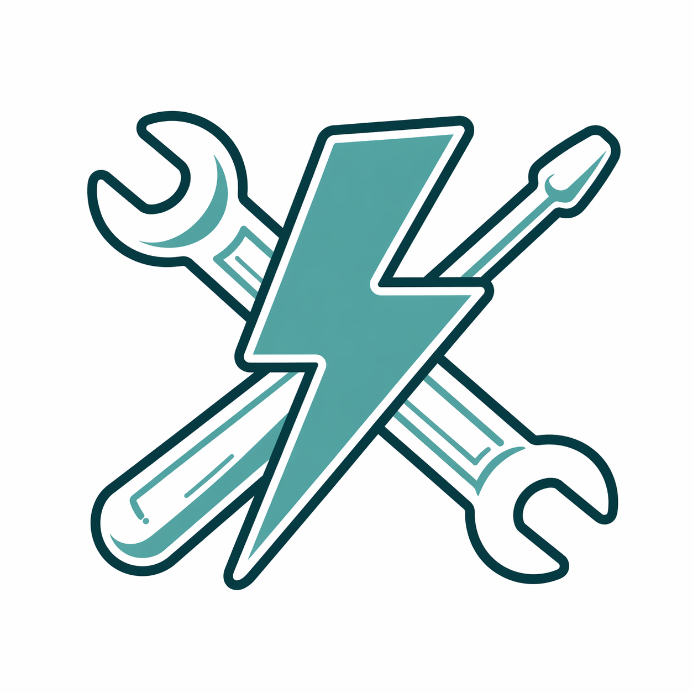

#  FastFixIt

FastFixIt is a platform that connects customers with local professionals for maintenance, repair, and home services.

---

# 🚀 What is FastFixIt?

FastFixIt helps customers find and contact local professionals for a wide range of services.

The platform provides a simple workflow:

* Search professionals nearby
* Send service requests
* Chat directly inside the app
* Receive updates in real time
* Leave reviews after completed jobs

---

# 📸 Application Preview
*A visual look inside the FastFixIt ecosystem, user interface, and professional workflow.*

  <!-- Sostituisci i nomi dei file se hai screenshot reali nella cartella assets o media -->
  
  
  

---

# ✨ Features

* User and provider accounts
* Service request management
* Real-time chat
* Push notifications
* Reviews and ratings
* Report system
* Profile management
* Secure authentication
* Location-based discovery

---

# 📱 Availability

FastFixIt is currently available for Android.

---

# 🔒 Security

The platform includes modern security protocols.

For security reports please see: [SECURITY.md](./SECURITY.md)

---

# 📄 Legal

Documentation:

* Privacy Policy
* Terms of Service
* Account Deletion Policy

Documentation files are available inside the `/docs` directory.

---

# 📬 Contact

For support, privacy requests, account deletion requests, or business inquiries:
👉 **[assistenza@fastfixit.it](mailto:assistenza@fastfixit.it)**

---

# ⚠️ Disclaimer

FastFixIt acts as a technology platform connecting customers and independent service providers.
Service providers operate independently and remain responsible for the services they offer.

---

# 👨‍💻 Authors

**Adriano Falone**
Founder of FastFixIt.

**Francesco Falone**
Developer of FastFixIt — Full-stack & Mobile architecture.

---

# 📄 License

Copyright (c) 2026 FastFixIt. All rights reserved.
